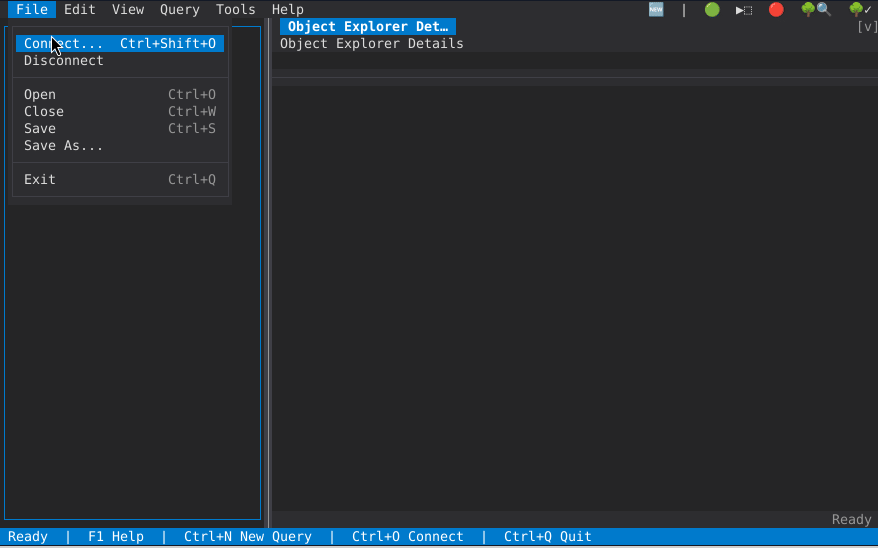

# goSSMS

**goSSMS** is a cross-platform, terminal-based SQL Server Management Studio
clone written in Go. No GUI, no X11, no CGO, no installation — a single
executable that runs on Linux, macOS, and Windows with no SQL client tools
or drivers required.



## Features

- **Object Explorer** — browse servers, databases, tables, views, procedures,
  functions, triggers, sequences, synonyms, and security objects in a tree
  matching SSMS's layout, including system databases/objects grouped
  separately. Drag a node into a query editor to insert its (schema-qualified)
  name. Right-click for context actions, or take a database offline/online.
- **Multiple query panels** — open as many T-SQL editor + results tabs as you
  need. Scripts split on `GO` batches sharing one connection, each result set
  gets its own tab, and a Messages tab collects `PRINT` output, row counts,
  and errors.
- **SQL editor** — syntax highlighting, word-wrap, line duplicate/move/
  indent/comment, undo/redo, and smart statement selection for running just
  the statement under the cursor.
- **IntelliSense** — autocompletes schemas, tables, views, and columns as you
  type, understands table aliases and multi-statement scripts, and can be
  toggled off in Options.
- **Execution Plan Viewer** — view estimated or actual execution plans as a
  cost-weighted operator graph, an expandable tree, or raw XML.
- **Properties dialogs** — multi-page, editable SSMS-style Properties for
  Server, Database, Login, Table, Schema, Server Role, Database Role,
  Database User, Index/Statistics, Key, and Foreign Key, plus New Database /
  New Login dialogs for creating objects from scratch.
- **SQL Server Agent** — browse and manage Jobs, Schedules, Alerts, and
  Operators; multi-page Job Properties (steps, schedules, alerts,
  notifications, history), run/stop a job, and view its run history.
- **Backup & Restore** — full option dialogs (destination, type, media,
  compression, point-in-time restore) running as cancellable background
  tasks with live progress.
- **Full authentication support** via [gosmo](https://github.com/radix29/gosmo):
  SQL Server Authentication, Windows Integrated Authentication, and Azure
  Entra ID (Default, Password, MSI, Service Principal, Interactive, Device
  Code, Azure CLI).
- **Script objects** — script any table/view/procedure/function as CREATE or
  DROP into a new query window.
- **Object Dependencies** — see what an object depends on and what depends
  on it.
- Configurable tree icon style (Emoji/Symbols/Portable/None), resizable
  panes, background task manager, status history log, and a Check for
  Updates dialog.

## Future Plans

- **Activity Monitor** — SSMS's live view of current sessions, blocking
  chains, and resource waits
- **Reports** — a handful of the most useful built-in SSMS reports
- **Always On Availability Groups (AAG)** — viewing and managing
  availability group topology and health

## Known Issues

- Windows 10 terminal (PowerShell, cmd) double character inputs
- Some Linux terminals (e.g. xfce4-terminal) eat some key shortcuts
- Entra authentication not tested at the moment — no infrastructure available
- Not tested on macOS yet — no Mac available
- Executables are built by GitHub but not signed; checksums are available

## Prerequisites

- Go 1.26 or later (only needed to build from source)
- Access to a SQL Server instance
- A terminal emulator supporting 256 colours and UTF-8 (most modern ones do
  — without UTF-8, tree icons and box-drawing characters won't render
  correctly)

## Installation

```bash
git clone https://github.com/radix29/gossms.git
cd gossms
go build -o gossms ./cmd/gossms

# Or install directly
go install github.com/radix29/gossms/cmd/gossms@latest
```

## Usage

```bash
./gossms
```

On first launch the screen is empty. Press **Ctrl+Shift+O** or use
**File → Connect** to open the connection dialog.

## Keyboard Reference

| Key | Action |
|-----|--------|
| `F1` | Help |
| `F10` | Activate menu bar |
| `Ctrl+Q` | Quit |
| `Ctrl+Shift+O` | Connect to server (falls back to `Ctrl+O`'s behavior on terminals that can't distinguish the Shift) |
| `Ctrl+O` | Open a `.sql` file as a new query |
| `Ctrl+N` | New query panel |
| `Ctrl+W` | Close active query |
| `Ctrl+S` | Save query |
| `Ctrl+C` / `Ctrl+X` / `Ctrl+V` | Copy / cut / paste |
| `Tab` | Switch focus explorer ↔ panels |
| `Ctrl+Tab` / `Ctrl+Shift+Tab` | Cycle to next / previous panel |
| `F5` | Execute query (selection if any, else the whole query); also refreshes the selected tree node or Properties page |
| `Ctrl+Enter` | Select the T-SQL statement at the cursor without executing it |
| `Ctrl+Left`/`Right` | Narrow / widen object explorer |
| `Ctrl+Up`/`Down` | Grow / shrink query editor |
| `Ctrl+PgUp`/`PgDn` | Previous / next result tab |
| `Ctrl+Z` / `Ctrl+Y` | Undo / redo in editor |
| `Ctrl+Space` (query editor) | Open/force IntelliSense suggestions |
| `Ctrl+R` (query editor) | Refresh the cached table/column list |
| `Shift+Arrow` | Select text |
| Click + drag | Select text with the mouse |
| Mouse wheel (results grid) | Scroll rows (`Shift`+wheel scrolls columns) |
| Arrow keys | Navigate tree / grid |
| `Enter` / `+` / `-` / `Backspace` | Expand / collapse tree node |
| `Shift+F10` / `Menu` key | Open the selected tree node's context menu |
| Right-click (grid cell) | "Show Value" — full cell text in a copyable popup |

## Configuration

A successful connection is saved automatically, most-recently-used first,
capped at 15 profiles. In the Connect dialog, typing 4+ characters into the
Server field looks up saved profiles by prefix.

Tools > Options controls the tree icon style, results grid limits, and
IntelliSense on/off — saved immediately to the config file:

- **Linux/macOS**: `~/.config/gossms/config.json`
- **Windows**: `%APPDATA%\gossms\config.json`

The config file is human-readable JSON, except saved passwords, which are
encrypted (AES-256-GCM) using a key stored in a separate `gossms.key` file
alongside it. Delete either file to reset all saved connections.

## Contributing

The codebase is currently unstable and going through regular refactoring,
so I'm not accepting pull requests at this time — please open an issue
instead. I'll start accepting PRs once the project reaches a released,
more stable state.

For the internal package layout and design rationale, see
[ARCHITECTURE.md](ARCHITECTURE.md).

## License

MIT
