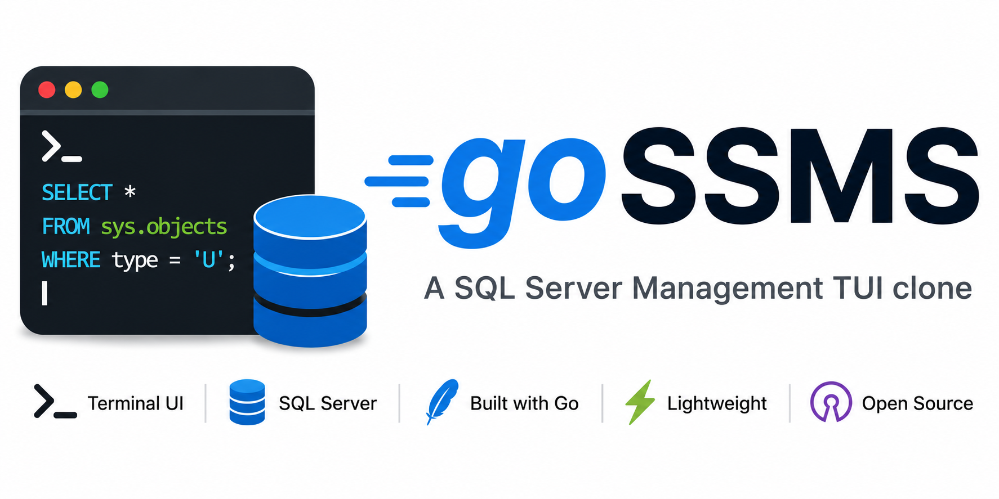
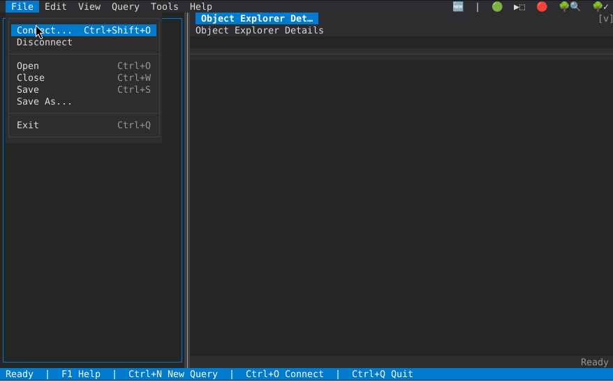

<p align="center">
  
</p>

<p align="center">
  <strong>Manage SQL Server without leaving macOS or Linux</strong>
</p>

<p align="center">
  <a href="https://github.com/radix29/gossms/commits/main"></a>
  <a href="LICENSE"></a>
</p>

# goSSMS

SQL Server Management Studio clone for MacOS, Linux and Windows.

**goSSMS** is a cross-platform, terminal-based SQL Server Management Studio
clone written in Go. No GUI, no X11, no CGO, no installation — a single
executable that runs on Linux, macOS, and Windows with no SQL client tools
or drivers required.



## Features

- **Object Explorer** — browse servers, databases, tables, views, procedures,
  functions, triggers, sequences, synonyms, and security objects in a tree
  matching SSMS's layout, including system databases/objects grouped
  separately. Drag a node into a query editor to insert its (schema-qualified)
  name. Right-click for context actions, or take a database offline/online.
- **Multiple query panels** — open as many T-SQL editor + results tabs as you
  need. Scripts split on `GO` batches sharing one connection, each result set
  gets its own tab, and a Messages tab collects `PRINT` output, row counts,
  and errors. Results are never row-capped — every row a query returns is
  shown, so a large enough result set is limited only by available memory.
  The toolbar's `Meta` toggle (also Query > Output Column Metadata) adds each
  result set's columns and their declared types to the Messages tab.
- **SQL editor** — syntax highlighting, word-wrap, line duplicate/move/
  indent/comment, undo/redo, and smart statement selection for running just
  the statement under the cursor. Find and Replace (`Ctrl+F`) with match
  case, whole word, regular expressions, and Replace All confined to the
  selection. Block (column) selection you can type into, and that pastes
  back rectangularly; double-click selects a word.
- **IntelliSense** — autocompletes schemas, tables, views, and columns as you
  type, understands table aliases and multi-statement scripts, and can be
  toggled off in Options.
- **Execution Plan Viewer** — view estimated or actual execution plans as a
  cost-weighted operator graph, an expandable tree, or syntax-highlighted
  raw XML.
- **Cell values worth reading get a real view** — "Show Value" on an XML or
  JSON result cell opens it in its own syntax-highlighted panel instead of a
  narrow popup.
- **Properties dialogs** — multi-page, editable SSMS-style Properties for
  Server, Database, Login, Table, Schema, Server Role, Database Role,
  Database User, Index/Statistics, Key, and Foreign Key, plus New Database /
  New Login dialogs for creating objects from scratch.
- **Permissions editing** — every permissions and securables grid cycles
  Grant → Grant With Grant → Deny → (none) with the right `WITH GRANT
  OPTION` / `CASCADE` / `GRANT OPTION FOR` statement issued for each
  transition, plus per-column grants on a table or view, filter boxes on the
  long grids, and an Effective Permissions page on Login and Database User
  Properties resolving what that principal can actually do once roles,
  ownership and inherited scopes are applied.
- **SQL Server Agent** — browse and manage Jobs, Schedules, Alerts, and
  Operators; multi-page Job Properties (steps, schedules, alerts,
  notifications, history), run/stop a job, and view its run history.
- **Backup & Restore** — full option dialogs (destination, type, media,
  compression, point-in-time restore) running as cancellable background
  tasks with live progress.
- **Full authentication support** via [gosmo](https://github.com/radix29/gosmo):
  SQL Server Authentication, Windows Integrated Authentication, and Azure
  Entra ID (Default, Password, MSI, Service Principal, Interactive, Device
  Code, Azure CLI).
- **Script objects** — script any table/view/procedure/function as CREATE or
  DROP into a new query window.
- **Object Dependencies** — see what an object depends on and what depends
  on it.
- **Activity Monitor** — History and Sample dashboards over live DMV data:
  batches/transactions/compiles, wait categories, memory composition and
  cache ratios, page activity, database I/O latency, log flushes, and
  checkpoints. Charts scroll on both axes, the refresh rate is selectable
  (2/3/5/10 s), and collection can be paused. Clicking a chart pins a
  readout that follows the sample it names across the plot and closes itself
  when that sample scrolls off. Thirty minutes of history is kept in memory
  and nothing is persisted. The TempDB tab tracks tempdb
  space, temp tables and the version store on its own slower schedule. The
  Block and Sessions tabs each show one run of a stored procedure in a full
  result grid — Block the current blocking chains, Sessions everything
  currently running. Neither refreshes on a timer: they run once when first
  opened and again on Refresh. Each procedure is used where it is found,
  `master.dbo.sp_block` / `master.dbo.sp_WhoIsActive`, or installed as
  `tempdb.dbo.usp_block` / `tempdb.dbo.usp_WhoIsActive`, with an "Install in
  master" button to make it permanent.
- Configurable tree icon style (Emoji/Symbols/Portable/None), resizable
  panes, background task manager, status history log, and a Check for
  Updates dialog.

## Future Plans

- **Reports** — a handful of the most useful built-in SSMS reports
- **Always On Availability Groups (AAG)** — viewing and managing
  availability group topology and health

## Known Issues

- Some terminals (e.g. xfce4-terminal) eat some key shortcuts
- Entra authentication not tested at the moment — no infrastructure available
- Not tested on macOS yet — no Mac available
- Executables are built by GitHub but not signed; checksums are available
- Database Restore dialog needs a rework
- SQL Agent needs a complete rework

## Prerequisites

- Go 1.26 or later (only needed to build from source)
- Access to a SQL Server instance
- A terminal emulator supporting 256 colours and UTF-8 (most modern ones do
  — without UTF-8, tree icons and box-drawing characters won't render
  correctly)

## Installation

- Download the binary for your platform from the github Release and execute it. 
- Does not have prerequisites like sql client, odbc etc.

https://github.com/radix29/gossms/releases

if you want to build it yourself:

```bash
git clone https://github.com/radix29/gosmo.git
git clone https://github.com/radix29/gossms.git
cd gossms
go build -o gossms ./cmd/gossms

# Or install directly
go install github.com/radix29/gossms/cmd/gossms@latest
```

## Usage

```bash
./gossms
```

goSSMS opens the Connect to Server dialog on startup. Fill it in to connect,
or press `Escape` to dismiss it and work offline — `Ctrl+Shift+O` reopens it
at any time.

## Keyboard Reference

| Key | Action |
|-----|--------|
| `F1` | Help |
| `F10` | Activate menu bar |
| `Ctrl+Q` | Quit |
| `Ctrl+Shift+O` | Connect to server (falls back to `Ctrl+O`'s behavior on terminals that can't distinguish the Shift) |
| `Ctrl+O` | Open a `.sql` file as a new query |
| `Ctrl+N` | New query panel |
| `Ctrl+W` | Close active query |
| `Ctrl+S` | Save query |
| `Ctrl+C` / `Ctrl+X` / `Ctrl+V` | Copy / cut / paste (on a focused results grid, `Ctrl+C` copies the selected cell or block) |
| `Tab` | Switch focus explorer ↔ panels |
| `Ctrl+Tab` / `Ctrl+Shift+Tab` | Cycle to next / previous panel |
| `F5` | Execute query (selection if any, else the whole query); also refreshes the selected tree node or Properties page |
| `Ctrl+Enter` | Select the T-SQL statement at the cursor without executing it |
| `Ctrl+Left`/`Right` | Narrow / widen object explorer |
| `Ctrl+Up`/`Down` | Grow / shrink query editor |
| `Ctrl+PgUp`/`PgDn` | Previous / next result tab |
| `Ctrl+Z` / `Ctrl+Y` | Undo / redo in editor |
| `Ctrl+F` (query editor) | Find and Replace — Match case, whole word, regular expression, and Replace All within the selection |
| `F3` / `Shift+F3` | Find next / previous, with the Find dialog closed |
| `Ctrl+F3` | Find the next occurrence of the word under the cursor |
| `Ctrl+Space` (query editor) | Open/force IntelliSense suggestions |
| `Ctrl+R` (query editor) | Refresh the cached table/column list |
| `Shift+Arrow` | Select text |
| `Alt+Shift+Arrow` (query editor) | Block (column) selection — typing, `Tab`, `Backspace`/`Delete` then apply to every row at once, and a block copied this way pastes back rectangularly |
| Click + drag | Select text with the mouse (`Alt`+drag makes it a block selection) |
| Double-click (query editor) | Select the word under the pointer |
| Mouse wheel (results grid) | Scroll rows (`Shift`+wheel scrolls columns) |
| Arrow keys | Navigate tree / grid |
| `Enter` / `+` / `-` / `Backspace` | Expand / collapse tree node |
| `Shift+F10` / `Menu` key | Open the selected tree node's context menu |
| Right-click (grid cell) | "Show Value" — full cell text in a copyable popup |
| Drag a grid header separator | Resize the column to its left, past the max default cell length if wanted |
| Double-click a header separator | Restore that column's default width |

Replace has no shortcut of its own — it is Edit > Replace..., or the
Replace fields inside the Find dialog. `Ctrl+H` is deliberately not bound:
terminals send it as the same byte (`0x08`) many of them send for
Backspace, so binding it would break Backspace on those.

## Configuration

A successful connection is saved automatically, most-recently-used first,
capped at 15 profiles. In the Connect dialog, typing 4+ characters into the
Server field looks up saved profiles by prefix.

Tools > Options controls the tree icon style, the results grid's maximum
*default* cell length (the width a column is given from its content — drag
a header separator to go wider), and IntelliSense on/off — saved
immediately to the config file:

- **Linux/macOS**: `~/.config/gossms/config.json`
- **Windows**: `%APPDATA%\gossms\config.json`

The config file is human-readable JSON, except saved passwords, which are
encrypted (AES-256-GCM) using a key stored in a separate `gossms.key` file
alongside it. Each password is sealed against the server, login, and
authentication method it belongs to, so a password blob copied onto a
different connection entry will not decrypt. Delete either file to reset all
saved connections.

If `config.json` can't be parsed it is kept as `config.json.corrupt` before
goSSMS falls back to defaults, and a password that can't be decrypted (a
replaced key file, a hand-edit) is left on disk untouched rather than
overwritten — re-enter it in the Connect dialog to replace it.

## Contributing

The codebase is currently unstable and going through regular refactoring,
so I'm not accepting pull requests at this time — please open an issue
instead. I'll start accepting PRs once the project reaches a released,
more stable state.

For the internal package layout and design rationale, see
[ARCHITECTURE.md](ARCHITECTURE.md).

## Acknowledgements

The Activity Monitor's Sessions tab runs **sp_WhoIsActive**, Adam Machanic's
activity-monitoring procedure — https://github.com/amachanic/sp_whoisactive —
with thanks. goSSMS carries a copy in `internal/activity/whoisactive.sql` so
it can install one on a server that hasn't got it.

## License

goSSMS is © 2026 radix29 and licensed **GPL-3.0-or-later**; see `LICENSE`
for the full text.

    goSSMS is free software: you can redistribute it and/or modify it under
    the terms of the GNU General Public License as published by the Free
    Software Foundation, either version 3 of the License, or (at your
    option) any later version.

    goSSMS is distributed in the hope that it will be useful, but WITHOUT
    ANY WARRANTY; without even the implied warranty of MERCHANTABILITY or
    FITNESS FOR A PARTICULAR PURPOSE. See the GNU General Public License
    for more details.

The bundled copy of sp_WhoIsActive is © 2007-2026 Adam Machanic and licensed
**GPL-3.0** under its own copyright, whose text is carried alongside it as
`internal/activity/LICENSE.sp_whoisactive`. It is used unmodified apart from
the two changes its own header records — the release script's SET-options and
stub-CREATE batches removed, and its declaration rewritten at install time so
the tempdb copy can be named `usp_WhoIsActive`. It is aggregated with goSSMS,
not derived from it; its copyright stays with its author.
