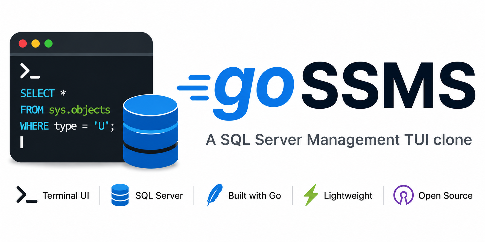
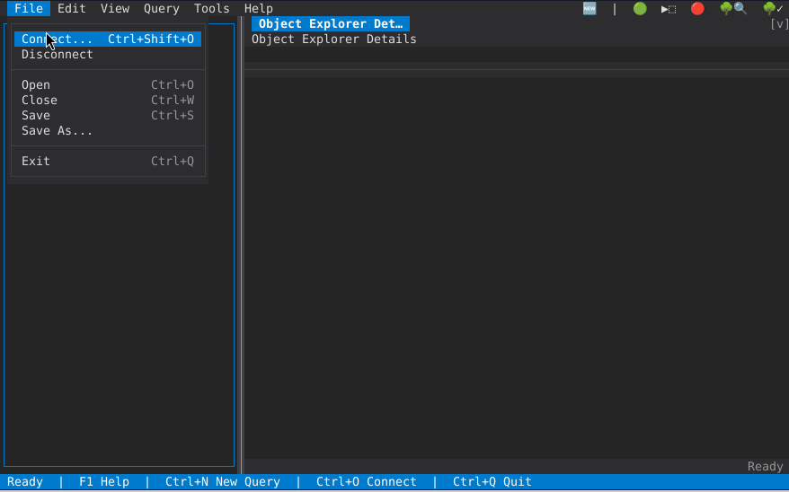

<p align="center">
  
</p>

<p align="center">
  <strong>SQL Server management for Linux, macOS, and Windows</strong>
</p>

<p align="center">
  <a href="https://github.com/radix29/gossms/commits/main"></a>
  <a href="LICENSE"></a>
  <a href="https://discord.gg/7YVKzB3vZ"></a>
</p>

# goSSMS

goSSMS is a terminal-based SQL Server management application. It is distributed
as a single executable and does not require an installer, SQL client tools, or
separate database drivers.



## Installation

### 1. Install goSSMS

#### Homebrew — macOS and Linux

```bash
brew install radix29/tap/gossms
```

Apple silicon and Intel; `brew upgrade gossms` tracks new releases.

#### APT — Debian, Ubuntu and derivatives

```bash
sudo install -d -m 0755 /etc/apt/keyrings
curl -fsSL https://radix29.github.io/apt/gossms.asc \
  | sudo tee /etc/apt/keyrings/gossms.asc > /dev/null
echo "deb [signed-by=/etc/apt/keyrings/gossms.asc] https://radix29.github.io/apt stable main" \
  | sudo tee /etc/apt/sources.list.d/gossms.list > /dev/null
sudo apt-get update && sudo apt-get install gossms
```

`amd64` and `arm64`. Details at
[radix29.github.io/apt](https://radix29.github.io/apt).

#### Direct download

Download the latest release for your platform:

**https://github.com/radix29/gossms/releases/latest**

Release binaries are available for:

- Windows (amd64)
- Linux (amd64 and arm64)
- macOS (Apple silicon/arm64 and Intel/amd64)

Extract the downloaded archive before running the application.

The binaries themselves are not signed for Windows SmartScreen or macOS
Gatekeeper, so those will warn on first run. Integrity is covered instead by
`checksums.txt`, published with every release and signed by the release
workflow with [cosign](https://github.com/sigstore/cosign) in keyless mode:

```bash
sha256sum -c --ignore-missing checksums.txt
cosign verify-blob \
  --bundle checksums.txt.bundle \
  --certificate-oidc-issuer https://token.actions.githubusercontent.com \
  --certificate-identity-regexp '^https://github\.com/radix29/gossms/\.github/workflows/release\.yml@' \
  checksums.txt
```

Packages installed through Homebrew or APT are covered without any of this:
Homebrew checks the formula's `sha256`, and APT checks the repository's
GPG-signed `Release` file.

### 2. Start goSSMS

Installed through Homebrew or APT, `gossms` is already on your `PATH`:

```bash
gossms
```

On Linux, both also add a **goSSMS** entry to the desktop's application menu,
which opens it in a terminal.

Otherwise, on Windows, open PowerShell in the extracted folder and run:

```powershell
.\gossms.exe
```

On Linux or macOS, open a terminal in the extracted folder and run:

```bash
chmod +x ./gossms
./gossms
```

`gossms --version` prints the version, commit, build date and licence and exits,
without starting the interface — quote it when reporting a bug.

You need a modern terminal with UTF-8 and 256-colour support, plus network access
to a SQL Server instance.

### 3. Connect to SQL Server

The Connect to Server dialog opens at startup. **History**, on the left, lists
the saved connections most recent first: select one to fill the form, and press
Enter (or click it again) to connect. On a terminal narrower than about 96
columns the History pane is not shown and the form takes the whole dialog —
nothing becomes unreachable, since anything History fills in can also be typed.

The form itself is on two tabs, **Connection Properties** and **Connection
String**; Ctrl+PgUp/PgDn or a click on the tab switches between them. **Custom
Properties** stays visible under both.

Under the form, **Reset** empties it back to the defaults — the saved
connections are left alone — and **Delete** removes the connection History is
highlighting, after asking. Deleting one takes the password saved with it, so
it is not undone by retyping the server name; Delete therefore sits alone at
the left end of the button row, away from Connect. F1 cycles the buttons for
the keyboard, left to right; Esc still cancels.

Enter the server name and choose SQL Server, Windows Integrated, or a supported
Microsoft Entra ID authentication method.

**Server Name** carries the port, as SSMS spells it: `host`, `host,1500`,
`host:1500`, or `host\instance,1500`. For a named instance such as
`SERVER\INSTANCE`, give no port so SQL Browser can resolve the instance — a
port there reaches the *default* instance instead. An IPv6 address can be typed
bare (`fe80::1`), bracketed, or with a port as `[fe80::1]:1433` or
`fe80::1,1433`.

**Remember Password** decides whether the password is written to
`config.json` at all. It is off for a new connection, so a password is used to
connect and then forgotten; connecting with it unticked also removes a password
stored for that connection earlier. A saved connection that has one opens with
the box ticked, so existing entries keep working until you untick one.

Fields the chosen authentication method does not use are greyed out — Remember
Password with them, for a method that sends no password. The
Microsoft Entra methods are:

| Method | Fields |
|---|---|
| **Microsoft Entra MFA** | Signs in through your browser. **User** is an optional login hint. |
| **Microsoft Entra Device Code** | Shows a code to enter at Microsoft's sign-in page, on any device — for a machine with no browser, or over SSH. |
| **Microsoft Entra Password** | **User** and **Password**. No MFA, and deprecated by Microsoft; prefer MFA. |
| **Microsoft Entra Service Principal** | The application's ID in **Client ID**, its client secret in **Password**. |
| **Microsoft Entra Managed Identity** | **Client ID** only for a user-assigned identity; blank for system-assigned. |
| **Microsoft Entra Default** | Tries environment variables, managed identity and the Azure CLI in turn. |
| **Microsoft Entra Azure CLI** | Uses the account `az login` signed in. |

New connections encrypt the whole session (**Encrypt: Mandatory**) with **Trust
Server Certificate** ticked, so an instance using SQL Server's self-signed
certificate still connects. Untick it to validate the certificate, and fill in
**Host Name In Certificate** when connecting by an IP address or alias the certificate does not
name. **Strict** (TDS 8.0) needs SQL Server 2022 or later, or Azure SQL
Managed Instance, with a real certificate. A saved connection keeps the setting
it was saved with.

**Custom Properties** passes further driver settings as `key=value` pairs
separated by `;` or `&` — for example `ApplicationIntent=ReadOnly;
MultiSubnetFailover=true` or `packet size=8192`. A setting the dialog has its
own field for is refused. The **Connection String** tab shows exactly what will
be dialled, with passwords masked.

On the server, goSSMS's sessions report `program_name` as `goSSMS` (Object
Explorer), `goSSMS - Query` (query windows) or `goSSMS - Activity Monitor`.

## Supported SQL Server versions

goSSMS supports **SQL Server 2016 SP1 (13.0.4001) and later** on Windows and
Linux, and **Azure SQL Managed Instance**. Features that are unavailable on the
connected SQL Server version or engine edition are hidden or disabled.

## Highlights

- **Object Explorer** for databases and database snapshots, tables and their
  System/FileTables/External/Graph folders, views, programmable objects
  (types, XML schema collections, assemblies, rules, defaults, plan guides),
  external resources, security, storage, Service Broker, SQL Server Agent,
  Always On, and other server objects.
- **Service Broker** in full: message types, contracts, queues, services,
  routes, remote service bindings and conversation priorities, each with a
  listing, a details view, a Properties dialog and scripting. Queue and Route
  Properties are editable — the two whose settings change while an application
  runs; the other five are read-only, because what they define is part of the
  application's own schema and belongs in the script that ships it. The folder
  is listed whether or not the broker is enabled on the database.
- **Certificates, asymmetric keys and symmetric keys** under each database's
  Security folder, `master` included: a listing and details view, scripting,
  delete, Properties, and a New dialog for each that creates the database
  master key first when one is needed. An expired certificate is marked
  `(Expired)`. A symmetric key's Properties add and remove its encryptions,
  opening the key in the same batch. A certificate backs up to files on the
  server's host, its private key optionally with it, and a certificate's or
  asymmetric key's private key can be removed, after a confirmation — the one
  irreversible step here. A certificate's or asymmetric key's Properties list
  the modules it signs and add or remove signatures (`ADD` / `DROP
  SIGNATURE`), and a procedure's, function's or trigger's details show who
  signed it. Keys are generated, never imported —
  importing reads files on the server's host, and is left to a query window.
  The **Database Master Key** has its own node: Properties, Back Up and
  Regenerate.
- **New User** covers every `CREATE USER` form — for a login, with a password,
  without login, Windows, certificate or asymmetric key, and Microsoft Entra
  on Azure and SQL Server 2022+ — with Owned Schemas and Membership.
- **Query editor** with multiple tabs, IntelliSense, `GO` batches (`GO n`
  repeats one), unlimited result rows, messages, and XML/JSON viewers. Each
  tab holds its own SQL
  Server session, so temp tables, `SET` options, `USE` and open transactions
  survive between runs; the bar above the editor shows the SPID and any open
  transaction. Enter keeps the current line's indentation, adding one level
  after a line ending in `(` or in `SELECT`/`FROM`/`WHERE`; Tab, Shift+Tab and
  the indent/dedent commands shift by the Options indent size (4 spaces by
  default). Pasted text keeps the indentation it came with. IntelliSense
  completes columns from CTEs, derived tables, sub-SELECTs and `PIVOT`, and
  from temp tables and table variables declared in the batch. It matches
  what you type anywhere in a name (`ord` finds `CustomerOrders`), listing
  names that start with it first; Ctrl+Space opens it on demand. Edit > Word
  Wrap (Alt+Z) soft-wraps long lines in every query tab — display only, with
  line numbers kept on each logical line.
- **Execution plans** as a graph, operator tree, or XML, with `.sqlplan` file
  support, missing-index details, and plan comparison.
- **Query Store** reports with plan viewing, comparison, tracking, forcing, and
  unforcing.
- **Administration tools** for properties, permissions, backup and restore
  (to disk or Azure Storage), attach and detach, indexes, statistics, and
  multi-object delete.
- **Monitoring** through Activity Monitor, blocking chains, sessions, and the
  SQL Server, SQL Agent and Database Mail logs — several log files, from any
  of them, can be merged into one date-sorted view.
- **Extended Events sessions** under Management: each session with its
  targets, running or stopped at a glance, a details view of what it collects
  and where, Start/Stop, scripting and delete. **New Session** and **Session
  Properties** edit one on four pages: a template (the Profiler's, query and
  connection tracking, lock counts, deadlocks, wait statistics), the event
  library with search and category/channel filters, per event its global
  fields, filter (typed, or built a clause at a time) and event fields, the
  targets with their parameters, and the buffer options; Script Changes shows
  the CREATE or the minimal ALTER. SQL Server's own sessions
  (`system_health` and its siblings) ask for the name to be typed before a
  delete. **Watch Live Data** on a running session and **View Target Data** on
  an `event_file` or `ring_buffer` target open an event grid over a details
  pane: pause, clear, a filter expression (`duration > 1000000 and
  database_name = 'app'`), columns chosen per session, grouping by one or more
  columns into collapsible groups with COUNT/SUM/AVG/MIN/MAX per group under
  their columns (Filter by This Group narrows to one, nested groups included),
  find,
  bookmarks, named display settings, export to CSV, tab-separated text or a
  CREATE TABLE + INSERT script, and from any event its SQL in a query window,
  its plan, or its deadlock XML. A session with nothing to read is offered a
  target; View Target Data reads a large `event_file` set from its newest
  files, and the viewer's event limit is in Options. **Merge Extended Event
  Files** (File menu, or the Extended Events folder) shows every server-side
  `.xel` file matching a pattern in one time-ordered view. On Azure an
  `event_file` is a blob: New Session and Session Properties offer the
  credentials named after a blob container and refuse a plain path, and Merge
  takes a blob URL pattern; of a Managed Instance's own files only
  `system_health*.xel` can be read. On Azure SQL Database the sessions are the
  database's own, under each database's Extended Events folder.
- **XEvent Profiler**: Alt+P (or Tools > XEvent Profiler, or the XEvent
  Profiler folder under Extended Events) starts a Standard or TSQL trace — its
  own `gossms_QuickSession*` session, created on first use — and opens it live.
  On a Managed Instance the session keeps its events in a `ring_buffer`.
- **Resource Governor** under Management: resource pools with their workload
  groups nested under them, and external resource pools; pools and groups
  show live counters beside their limits; the node's label says whether the governor is
  disabled or has a reconfiguration pending. **Resource Governor Properties**
  edits the enabled state, the classifier (pick a function in master, or
  start one from a template), the I/O limit, and every pool and group on its
  own page; Apply runs the changes in dependency order and then puts them in
  force — or keeps a disabled governor disabled. Enable, Disable,
  Reconfigure, Reset Statistics, Delete and Script as from the tree. Pool
  affinity is edited on the pool pages: Automatic, or a tick per scheduler
  (CPU for an external pool) with its NUMA node, in processor group 0.
- **Database Mail** under Management: status, queues, profiles, accounts and
  recent failed items at a glance. **Database Mail Properties** replaces
  SSMS's wizard — 'Database Mail XPs', SMTP accounts (a blank password keeps
  the stored one), profiles with their accounts in failover order, public and
  private profile security, and the system parameters — in one Apply.
  **Send Test E-Mail** waits for the outcome and shows the SMTP error when
  delivery fails; Start/Stop, scripting, and the Database Mail log with
  Delete... for old rows. Configuring needs `db_owner` in msdb or CONTROL
  SERVER, not sysadmin (a Basic-auth account also needs ALTER ANY
  CREDENTIAL); members of `DatabaseMailUserRole` can send test mail.
- **Azure SQL Managed Instance** support, including an Activity Monitor
  Instance tab showing CPU, storage, I/O and the resource governor's limits.
- **Least-privilege operation**: unavailable actions are disabled and missing
  permissions are identified where SQL Server exposes that information.
- **Long writes run in the foreground**: a delete, rename, take-offline,
  failover or Agent action shows a progress dialog with elapsed time and a
  Cancel that cancels the statement on the server. Cancel is greyed, with the
  reason, where interrupting is unsafe — a failover, or a revert to a
  snapshot.

## Required rights

goSSMS does not add privileges to your login. Connecting requires `CONNECT SQL`;
seeing and opening databases may also require `VIEW ANY DATABASE` and `CONNECT`
on the database. Each query and administrative action requires the same SQL
Server permission it would require in another client.

When a permission is missing, goSSMS disables the affected action, opens an
editable page as read-only, displays inaccessible values as `N/A`, or reports the
required permission where possible. A read-only page's grids can still be moved
through, so the details of every row — each event of a session, each role of a
login — can be read; nothing on the page can be changed.

### `VIEW SERVER STATE`

Live server information, including Activity Monitor data and some server
properties, requires `VIEW SERVER STATE`.

On SQL Server 2022 and later, `VIEW SERVER STATE` is split into
`VIEW SERVER PERFORMANCE STATE` and `VIEW SERVER SECURITY STATE`; either narrower
grant covers its corresponding information.

## Configuration

Connections are saved automatically, with the 30 most recent listed first in
the Connect dialog's History pane. A password is saved only when **Remember
Password** is ticked.
Tools > Options controls the tree icon style, default results-grid cell width,
the characters shown per column in Results to Text (default 256, as in SSMS),
query-editor indent size (spaces per indent level, default 4) and IntelliSense.

Configuration is stored at:

- Linux/macOS: `~/.config/gossms/config.json`
- Windows: `%APPDATA%\gossms\config.json`

If gossms crashes, or the terminal is closed with queries unsaved, each
unsaved query tab is written to the `recovered` folder next to
`config.json`. Two gossms instances can run at once; each merges its
connection changes into `config.json` rather than overwriting the other's.

Saved passwords are encrypted with AES-256-GCM using `gossms.key`, stored next to
the configuration file. Delete both files to reset saved connections. Each
password is bound to its connection's server, port, user, authentication method
and encryption settings: editing any of those in `config.json` by hand makes the
saved password unreadable, and it has to be typed again.

## Links

- [Releases and downloads](https://github.com/radix29/gossms/releases)
- [Release notes](https://github.com/radix29/gossms/blob/main/RELEASE.md)
- [Report an issue](https://github.com/radix29/gossms/issues)
- [Discord server](https://discord.gg/7YVKzB3vZ) — questions, feedback and release announcements

## License

goSSMS is © 2026 radix29 and licensed under
[GPL-3.0-or-later](LICENSE). The bundled
[sp_WhoIsActive](https://github.com/amachanic/sp_whoisactive) is © 2007–2026
Adam Machanic and retains its own GPL-3.0 copyright.
