Welcome to the gossms wiki!

  

  <strong>Manage SQL Server without leaving macOS or Linux</strong>

  
  

# goSSMS

A terminal-based SQL Server Management Studio for Linux, macOS, and Windows.
One executable — no GUI, no installer, no SQL client tools or drivers
required.We'll put more content here soon.

# Gallery

### Connection

**Connect to SQL Server** — The connection dialog lets you pick an auth mode,
specify server, database and credentials.

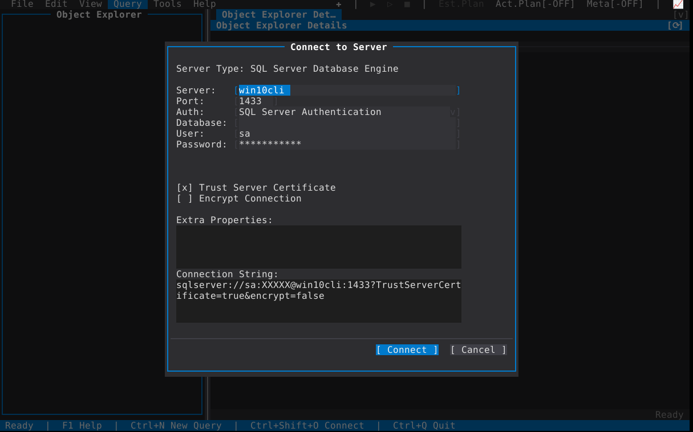

### Object Explorer

**Browse your servers** — A tree view of instances, databases and all their
dbo-schema objects. Expand folders to inspect tables, views, stored procedures
and more.

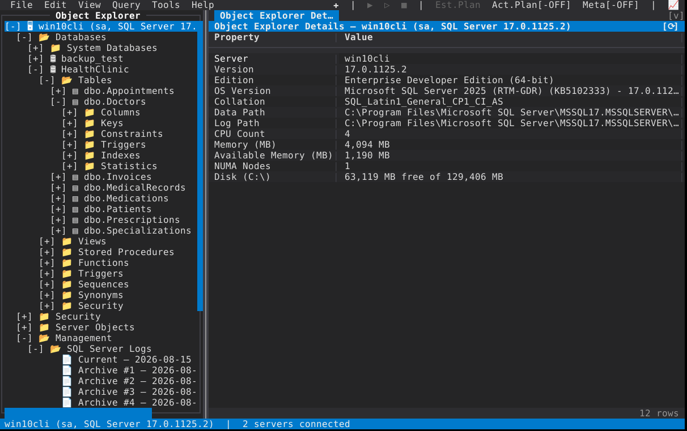

**Server properties** — Details about the connected SQL Server instance:
capabilities, configuration settings and metadata.

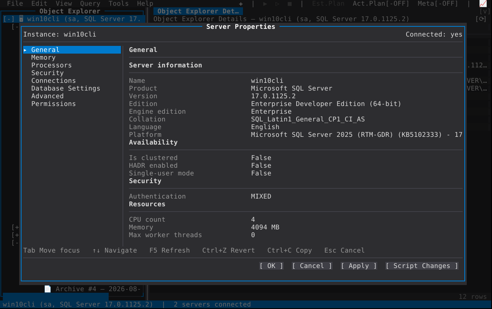

**Object detail browser** — The right-hand pane shows properties for whichever
node you select in the tree. Click any object to see its details.

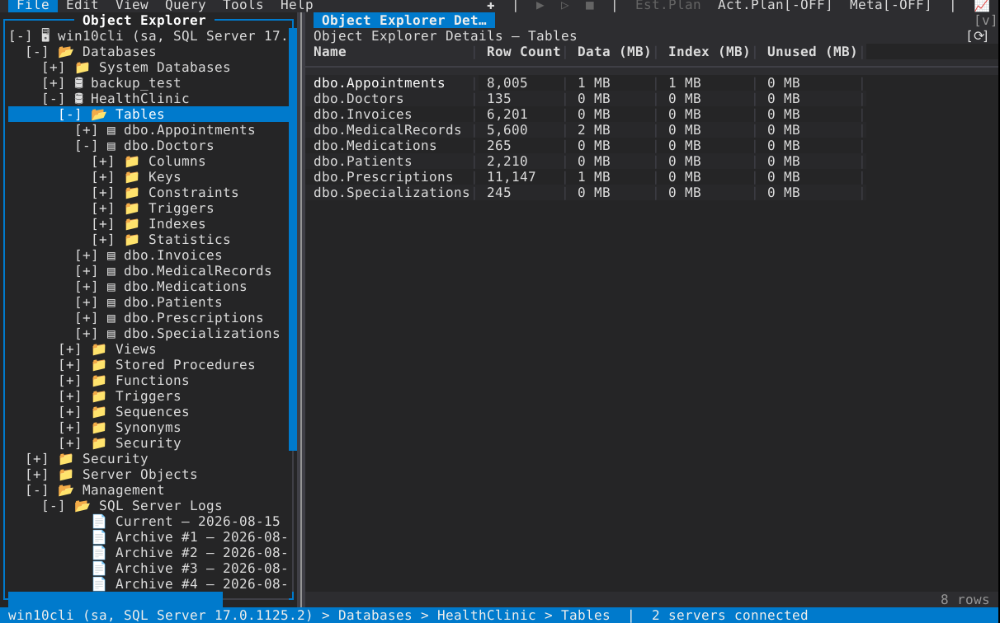

### Database & Server Properties

**Database properties** — Full property sheet for a database: general info,
files, options, recovery model and more.

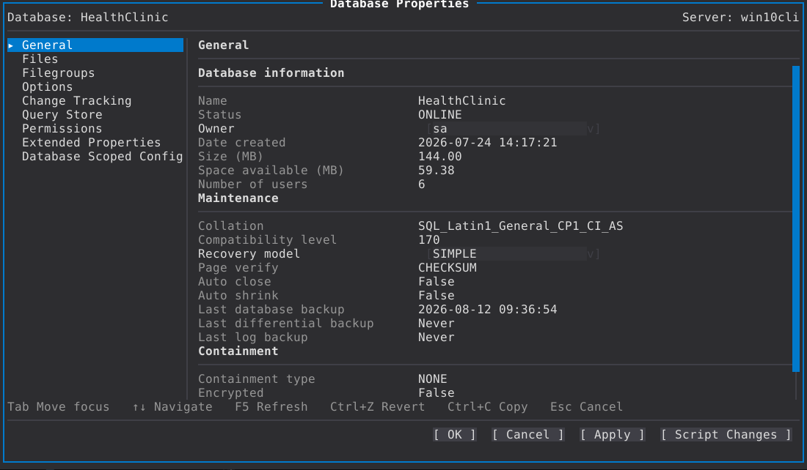

### Query Editor

**Write and run queries** — Syntax-aware editor with query execution buttons,
toolbar controls and result tabs below the text area.

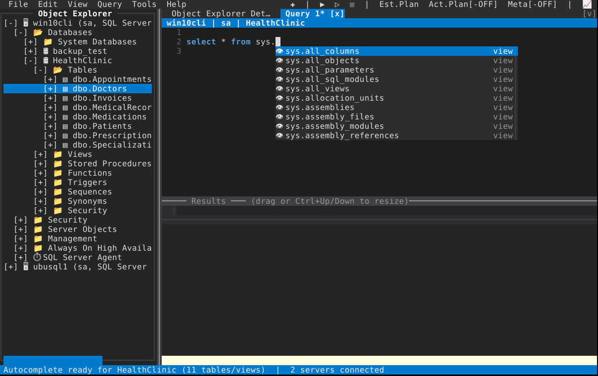

**Multiple result sets** — Running a batch that returns several result sets
generates multiple tabs, each showing its own grid of rows.

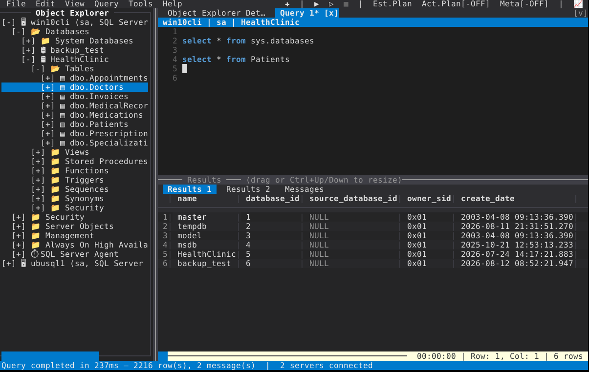

### Execution Plans

**Graphical execution plan** — The visual plan renderer draws operators as nodes
with arrows showing data flow, plus cost percentages and row estimates.

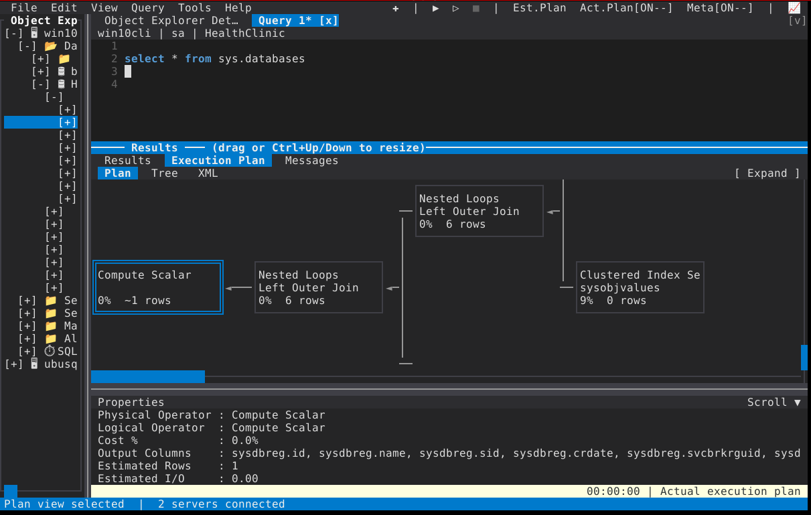

**Tree-view execution plan** — An alternative to the graphical renderer: a
collapsible tree that shows each operator's details in text form.

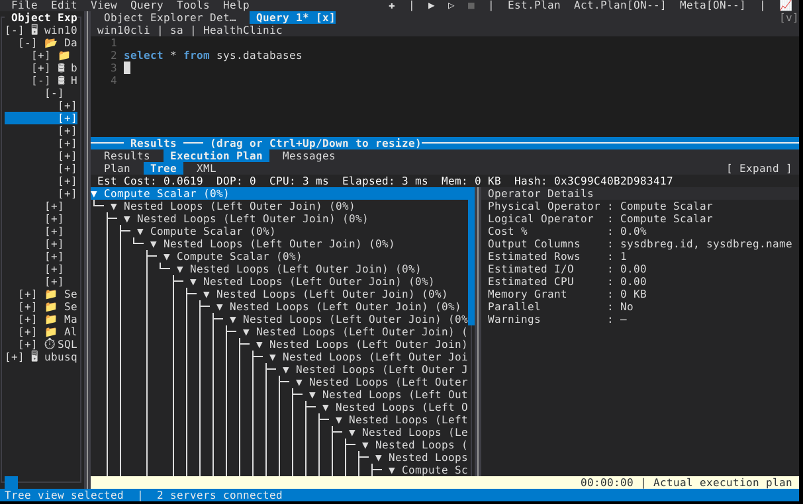

### Activity Monitor

**Historical activity view** — See past queries and their durations from the
activity monitor's historical data collection.

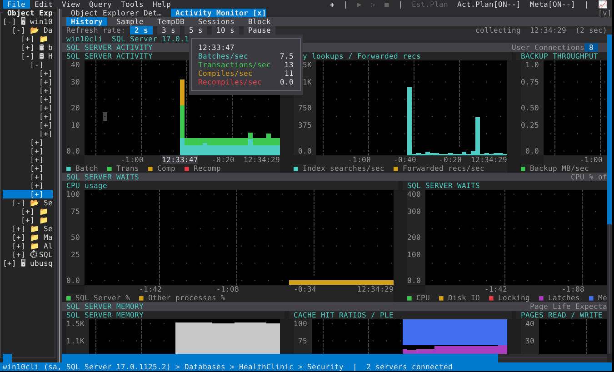

**Real-time system health** — The sampled view shows current blocking chains,
active sessions, resource waits and CPU/disk I/O trends.

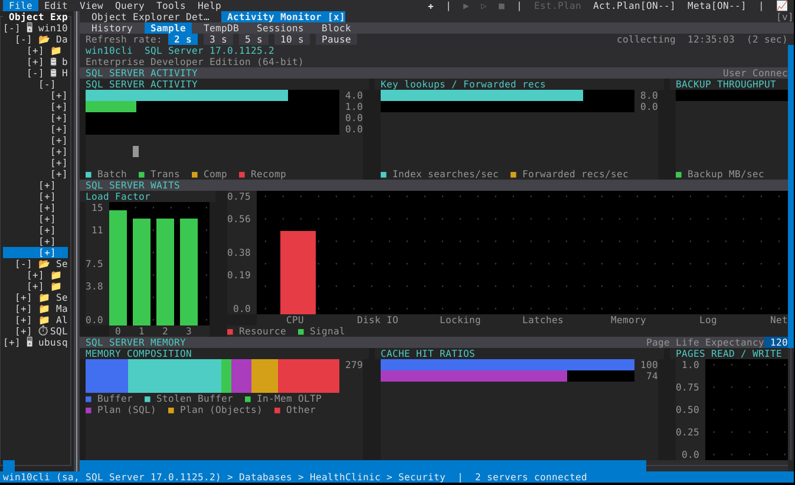

**TempDB monitoring** — A dedicated view for tempdb: file usage, session temp
table allocations and internal object churn in real time.

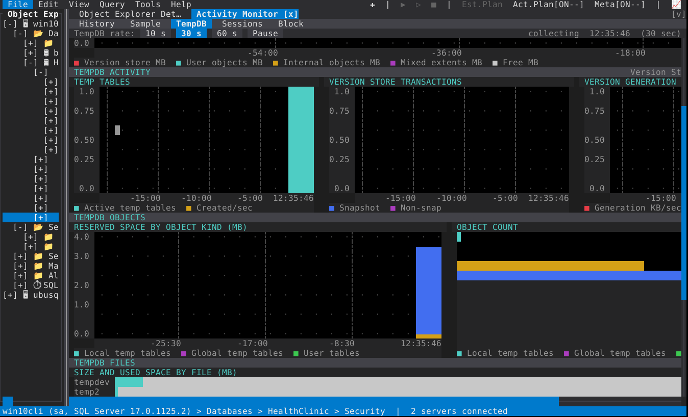

### Always On

**Availability Group configuration** — Create or manage Always On Availability
Groups from the Properties sheet, including replica settings, listener config,
and failover policy.

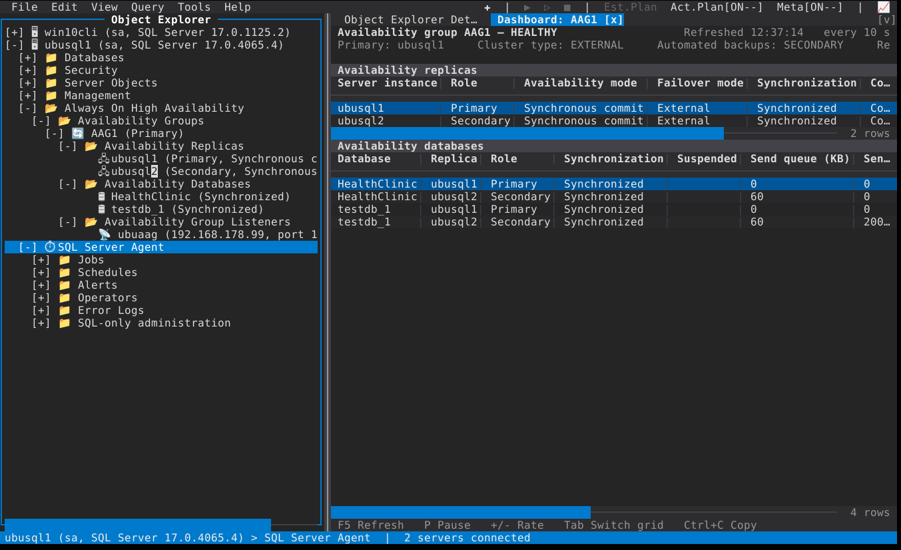

