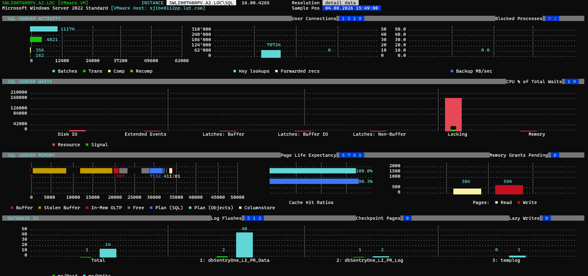
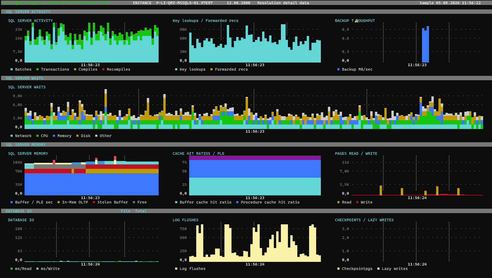

# SQL Server Activity Monitor — Handover

This document defines the desired result for SQL Server Activity Monitor pages in an existing Go terminal UI application. The application already has a TUI toolkit and infrastructure based on tcell; the new pages should feel native to that existing application and use its established visual language, navigation, theming, and page behavior.

The document is intentionally focused on what the dashboard should show and how it should behave from a user perspective. It does not prescribe implementation details, data structures, renderer algorithms, or framework changes.

## Purpose

The SQL Server Activity Monitor is a dense operational dashboard for reviewing current and recent SQL Server health, workload, waits, memory pressure, and database IO behavior.

The visual mockup screenshots are provided as separate PNG files:

- `hi.png` — screenshot of the SQL Server Activity History mockup.
- `sa.png` — screenshot of the SQL Server Activity Snapshot mockup.

These PNGs are the primary visual references for the intended appearance. This handover document describes the expected result, behavior, page structure, and dashboard metrics.

The dashboard should help an operator answer these questions quickly:

- Is the SQL Server instance busy right now?
- Are sessions blocked or are waits increasing?
- Is workload dominated by batches, transactions, compiles, or recompiles?
- Are key lookups, forwarded records, or backup activity unusual?
- Are waits coming from CPU, disk, memory, network, or other categories?
- Is memory stable, pressured, or shifting between memory components?
- Are cache hit ratios and page life expectancy healthy?
- Are reads, writes, log flushes, checkpoints, or lazy writes spiking?
- Is database file IO latency high?

## Expected pages

The Activity Monitor consists of two related pages.

### SQL Server Activity Snapshot

A point-in-time detail page for the selected SQL Server instance.

This page shows current values and compact charts for:

- SQL Server activity.
- SQL Server waits.
- SQL Server memory.
- Database IO.

It should be useful when the user wants a quick current-state summary for one instance.

### SQL Server Activity History

A history/overview page for the selected SQL Server instance.

This page shows recent time-series behavior across the same main categories:

- SQL Server activity.
- SQL Server waits.
- SQL Server memory.
- Database IO.

It should be useful when the user wants to see trends, bursts, spikes, and relationships between metrics over a recent time window.

## Visual result

The dashboard should look like a dark terminal-native monitoring page:

- Dark background.
- Clear section headers.
- Multiple compact panels visible at once.
- High-contrast metric colors.
- Compact legends.
- Smooth Unicode block charts.
- Stable chart colors across refreshes.
- No large empty decorative areas.
- No warning marker glyph in dashboard chrome.

The layout should prioritize readability at 120 columns and should look best at 150 columns or wider. When terminal height is limited, the page should support vertical scrolling rather than hiding sections unpredictably.

## UTF-8 glyph definition

The Go application is UTF-8, so these glyphs may be embedded directly in source or defined in the existing toolkit's glyph/theme layer.

```text
Full block:                 █
Lower half block:           ▄
Vertical eighth blocks:     ▁ ▂ ▃ ▄ ▅ ▆ ▇ █
Horizontal eighth blocks:   ▏ ▎ ▍ ▌ ▋ ▊ ▉ █
Legend square:              ■
Dotted vertical grid:       ┆
Grid dot:                   ·
Box drawing:                ─ │ ┌ ┐ └ ┘
```

## Color expectations

The exact colors should come from the existing TUI theme. The dashboard needs visually distinct colors for the main series groups.

Recommended semantic color usage:

| Semantic role | Expected visual use |
|---|---|
| Background | Main dashboard background |
| Muted gray | Borders, grid lines, secondary labels |
| White or light gray | Axis labels, numeric values, important text |
| Cyan | Primary activity series, section emphasis, network/key lookup style metrics |
| Green | Transactions, CPU-related series, read-oriented positive series |
| Yellow or orange | Disk, write, log, compile, checkpoint style metrics |
| Blue | Memory, backup throughput, cache-related series |
| Red or orange-red | Recompiles, pressure, query grants, high-latency or high-risk series |
| Purple | Page life expectancy or alternate cache/memory series |

Colors should not be the only way to understand the dashboard. Labels and legends must remain visible and meaningful.

## Page 1: SQL Server Activity Snapshot



### Intended result

The snapshot page should show the selected SQL Server instance, host/environment context, sample time, and current metric values. It should be visually dense but readable, with each major SQL Server area separated by section headers.

### Snapshot page layout

The page should contain these sections in order:

1. Header area with instance, host/environment, and sample time.
2. SQL SERVER ACTIVITY.
3. SQL SERVER WAITS.
4. SQL SERVER MEMORY.
5. DATABASE IO.

### Snapshot page visual mockup

```text
SWLI007400PV.A2.LOC [VMware VM]                 INSTANCE  SWLI007400PV.A2.LOC\SQL        Resolution detail data
Microsoft Windows Server 2022 Standard          [VMware Host: sjibe0112pp.lqt.com]       Sample Pos 04.08.2026 15:49:00

  SQL SERVER ACTIVITY                                      User Connections 1 5 1 9       Blocked Processes 9 2
  -----------------------------------------------------------------------------------------------
  Batches/Transactions/Compiles      Key lookups / Forwarded recs            Backup MB/sec
  0 ... 12400 ... 62000              310'000 ... 0 + right scale             50.0 ... 0.0
  ███▉ 11174                         ███▊ 78724                              0.0
  ██▎ 4821                           0
  ▏ 356
  ▏ 162
          ■ Batches  ■ Trans  ■ Comp  ■ Recomp      ■ Key lookups  ■ Forwarded recs       ■ Backup MB/sec

  SQL SERVER WAITS                                                               CPU % of Total Waits 1 9
  -----------------------------------------------------------------------------------------------
  Disk IO | Extended Events | Latches: Buffer | Latches: Buffer IO | ... | Locking | Memory
                    resource and signal wait bars
                         ■ Resource  ■ Signal

  SQL SERVER MEMORY                         Page Life Expectancy 5 7 6 1          Memory Grants Pending 0
  -----------------------------------------------------------------------------------------------
  memory composition stacked bar       cache hit ratios                 pages read/write bars
  [Stolen Buffer][In-Mem][Free][Plan][Columnstore][Other]               Read / Write
  ■ Buffer ■ Stolen Buffer ■ In-Mem OLTP ■ Free ■ Plan (SQL) ■ Plan (Objects) ■ Columnstore ■ Query Grants ■ Other

  DATABASE IO                          Log Flushes 5 1 2     Checkpoint Pages 0     Lazy Writes 0
  -----------------------------------------------------------------------------------------------
  ms/Read and ms/Write by file: Total, data file, log file, templog
```

The mockup communicates layout and density. The final page should follow the same information hierarchy even if spacing differs because of the existing toolkit.

### Snapshot metrics

| Section | Metric | Meaning | Example value |
|---|---|---|---:|
| SQL Server Activity | User Connections | Number of connected SQL Server users/sessions. | 1519 |
| SQL Server Activity | Blocked Processes | Number of processes currently blocked. | 92 |
| SQL Server Activity | Batches | Batch request activity during the sample interval. | 11174 |
| SQL Server Activity | Trans | Transaction activity during the sample interval. | 4821 |
| SQL Server Activity | Comp | SQL compiles during the sample interval. | 356 |
| SQL Server Activity | Recomp | SQL recompiles during the sample interval. | 162 |
| SQL Server Activity | Key lookups | Key lookup activity. High values may indicate lookup-heavy query plans. | 78724 |
| SQL Server Activity | Forwarded recs | Forwarded record activity. High values can indicate heap forwarding issues. | 0 |
| SQL Server Activity | Backup MB/sec | Current backup throughput. | 0.0 |
| SQL Server Waits | CPU % of Total Waits | CPU wait share relative to total waits. | 19 |
| SQL Server Waits | Disk IO | Wait activity associated with disk IO. | visual bar |
| SQL Server Waits | Extended Events | Wait activity associated with Extended Events. | visual bar |
| SQL Server Waits | Latches: Buffer | Buffer latch wait activity. | visual bar |
| SQL Server Waits | Latches: Buffer IO | Buffer IO latch wait activity. | visual bar |
| SQL Server Waits | Latches: Non-Buffer | Non-buffer latch wait activity. | visual bar |
| SQL Server Waits | Locking | Lock wait activity. | visual bar |
| SQL Server Waits | Memory | Memory-related wait activity. | visual bar |
| SQL Server Memory | Page Life Expectancy | Approximate duration pages stay in memory before eviction. | 5761 |
| SQL Server Memory | Memory Grants Pending | Number of memory grants waiting. | 0 |
| SQL Server Memory | Buffer | Buffer pool memory component. | visual segment |
| SQL Server Memory | Stolen Buffer | Stolen buffer memory component. | visual segment |
| SQL Server Memory | In-Mem OLTP | Memory used by In-Memory OLTP. | visual segment |
| SQL Server Memory | Free | Free memory component. | visual segment |
| SQL Server Memory | Plan (SQL) | SQL plan cache component. | visual segment |
| SQL Server Memory | Plan (Objects) | Object plan cache component. | visual segment |
| SQL Server Memory | Columnstore | Columnstore memory component. | visual segment |
| SQL Server Memory | Query Grants | Query memory grant component. | visual segment |
| SQL Server Memory | Other | Other memory components. | visual segment |
| Database IO | Log Flushes | Log flush activity during the sample interval. | 512 |
| Database IO | Checkpoint Pages | Pages written by checkpoints. | 0 |
| Database IO | Lazy Writes | Lazy writer activity. | 0 |
| Database IO | ms/Read | Read latency by selected database file or total. | visual bar |
| Database IO | ms/Write | Write latency by selected database file or total. | visual bar |

### Snapshot behavior

The snapshot page should:

- Show one coherent current sample.
- Keep related metrics grouped in the same visual section.
- Use compact labels where space is limited.
- Use the shortened activity labels Trans, Comp, and Recomp so the legend fits.
- Keep the selected instance and sample time visible at the top.
- Allow scrolling if the terminal cannot show all sections at once.

## Page 2: SQL Server Activity History



### Intended result

The history page should show recent trends for activity, waits, memory, and IO. It should make bursts, spikes, sustained load, and cross-metric relationships visible at a glance.

The page should use multiple compact time-series panels. Each panel should show a recent time window ending at the current sample or selected sample position.

### History page layout

The page should contain these sections in order:

1. Header area with instance, host/environment, and sample time or selected time position.
2. SQL SERVER ACTIVITY with three side-by-side panels.
3. SQL SERVER WAITS with one full-width panel.
4. SQL SERVER MEMORY with three side-by-side panels.
5. DATABASE IO with three side-by-side panels.

### History page visual mockup

```text
P-LI-QMI-MSSQL5-01.97E9722722C8.DATABASE.WIND...   INSTANCE P-LI-QMI-MSSQL5-01.97E97   12.00.2000   Resolution detail data

SQL SERVER ACTIVITY
┌────────────────────────────────────┐  ┌────────────────────────────────────┐  ┌────────────────────────────────────┐
│ SQL SERVER ACTIVITY                │  │ Key lookups / Forwarded recs       │  │ BACKUP THROUGHPUT                  │
│ 30000 ┆      ▆▇▅█▆▅▇▇▅▆█▅          │  │ 120K  ┆     ▆▇▆▅█▆▇▅▆              │  │ 1.2 ┆             ▇        █        │
│ 22500 ┆  ▅▇██████████████▆▅        │  │  90K  ┆   ▅██████████████▅         │  │     ┆                              │
│ 15000 ┆ ████████████████████       │  │  60K  ┆ ████████████████████       │  │     ┆                              │
│  7500 ┆ ████████████████████       │  │  30K  ┆ ████████████████████       │  │     ┆                              │
│     0 └───────────────────── now   │  │    0  └──────────────────── now    │  │ 0.0 └──────────────────── now      │
│     ■ Batches ■ Transactions ■ Compiles ■ Recompiles                         │  │       ■ Backup MB/sec              │
└────────────────────────────────────┘  └────────────────────────────────────┘  └────────────────────────────────────┘

SQL SERVER WAITS
┌──────────────────────────────────────────────────────────────────────────────────────────────────────────────────────┐
│ SQL SERVER WAITS                                                                                                     │
│ 12000 ┆       █       █                              █              █                                                │
│  9000 ┆      ██      ██        █                    ██       █     ██                                                │
│  6000 ┆  ████████████████   █████       █       ████████████████████                                                │
│  3000 ┆██████████████████████████████████████████████████████████████                                                │
│     0 └────────────────────────────────────────────────────────────────────────────────────────────────── now        │
│       ■ Network ■ CPU ■ Memory ■ Disk ■ Other                                                                        │
└──────────────────────────────────────────────────────────────────────────────────────────────────────────────────────┘

SQL SERVER MEMORY
┌────────────────────────────────────┐  ┌────────────────────────────────────┐  ┌────────────────────────────────────┐
│ SQL SERVER MEMORY                  │  │ CACHE HIT RATIOS / PLE             │  │ PAGES READ / WRITE                 │
│ 140K ┆█████████████████████████    │  │ 100% ┆█████████████████████████    │  │ 14K ┆███▅▁       ▃      ▆           │
│ 105K ┆█████████████████████████    │  │  75% ┆█████████████████████████    │  │ 10K ┆█████       █      █           │
│  70K ┆█████████████████████████    │  │  50% ┆█████████████████████████    │  │  6K ┆█████       █      █           │
│  35K ┆█████████████████████████    │  │  25% ┆████████▁▁▁▁▁▁▁▁▁▁▁▁       │  │  2K ┆█████  ▂    █  ▂   █           │
│    0 └───────────────────── now    │  │   0% └──────────────────── now     │  │   0 └──────────────────── now      │
│ ■ Buffer / PLE sec ■ In-Mem OLTP ■ Stolen Buffer ■ Free ...  │           │ ■ Read ■ Write                         │
└────────────────────────────────────┘  └────────────────────────────────────┘  └────────────────────────────────────┘

DATABASE IO                                      File  Total
┌────────────────────────────────────┐  ┌────────────────────────────────────┐  ┌────────────────────────────────────┐
│ DATABASE IO                        │  │ LOG FLUSHES                        │  │ CHECKPOINTS / LAZY WRITES          │
│ 250 ┆█       ▄                     │  │ 1000 ┆▇ ▇▁▁▇▇▁▁▇▁▁▇▇              │  │ 4 ┆                 █              │
│ 125 ┆█       █                     │  │  500 ┆███████████████              │  │ 2 ┆                 █              │
│   0 └───────────────────── now     │  │    0 └──────────────────── now     │  │ 0 └──────────────────── now        │
│       ■ ms/Read ■ ms/Write         │  │        ■ Log flushes               │  │       ■ Checkpointpgs ■ Lazy writes │
└────────────────────────────────────┘  └────────────────────────────────────┘  └────────────────────────────────────┘
```

The mockup communicates page composition, relative density, labels, and chart style. It does not require exact spacing in the final application.

## History dashboard metrics

### SQL SERVER ACTIVITY section

This section describes workload volume and compilation behavior.

| Panel | Metric | Meaning | Expected visual behavior |
|---|---|---|---|
| SQL SERVER ACTIVITY | Batches | Batch request activity over time. | High, noisy workload series. |
| SQL SERVER ACTIVITY | Transactions | Transaction activity over time. | Lower than batches, follows workload shape. |
| SQL SERVER ACTIVITY | Compiles | SQL compile activity over time. | Small compared with batches, occasional spikes. |
| SQL SERVER ACTIVITY | Recompiles | SQL recompile activity over time. | Smallest activity series, occasional spikes. |
| Key lookups / Forwarded recs | Key lookups | Lookup-heavy plan activity. | Usually high, tens of thousands in mock history. |
| Key lookups / Forwarded recs | Forwarded recs | Forwarded record activity. | Very small relative to key lookups. |
| BACKUP THROUGHPUT | Backup MB/sec | Backup throughput in megabytes per second. | Mostly zero with isolated spikes. |

### SQL SERVER WAITS section

This section shows where SQL Server is spending wait time. The panel should be full-width because wait patterns are easier to read with more horizontal history.

| Panel | Metric | Meaning | Expected visual behavior |
|---|---|---|---|
| SQL SERVER WAITS | Network | Wait activity associated with network delays. | Low to moderate baseline with occasional contribution. |
| SQL SERVER WAITS | CPU | CPU-related wait contribution. | Periodic spikes during CPU pressure. |
| SQL SERVER WAITS | Memory | Memory-related wait contribution. | Rises during reporting or memory pressure windows. |
| SQL SERVER WAITS | Disk | Disk IO wait contribution. | Spikes during IO bursts. |
| SQL SERVER WAITS | Other | Remaining wait categories grouped together. | Background component with occasional increases. |

### SQL SERVER MEMORY section

This section shows memory composition, cache behavior, page life expectancy, and page read/write activity.

| Panel | Metric | Meaning | Expected visual behavior |
|---|---|---|---|
| SQL SERVER MEMORY | Buffer / PLE sec | Buffer-related memory component and page-life context. | Dominant memory component, mostly stable. |
| SQL SERVER MEMORY | In-Mem OLTP | Memory used by In-Memory OLTP. | Smaller steady component. |
| SQL SERVER MEMORY | Stolen Buffer | Stolen buffer memory component. | Rises with memory pressure. |
| SQL SERVER MEMORY | Free | Free memory component. | Shrinks when workload and memory pressure rise. |
| SQL SERVER MEMORY | Plan (SQL) | SQL plan cache memory. | Stable cache component. |
| SQL SERVER MEMORY | Plan (Objects) | Object plan cache memory. | Smaller stable cache component. |
| SQL SERVER MEMORY | Columnstore | Columnstore memory component. | Moderate component, can rise during reporting. |
| SQL SERVER MEMORY | Query Grants | Query memory grants. | Spikes during reporting or batch windows. |
| SQL SERVER MEMORY | Other | Remaining memory components. | Stable background component. |
| CACHE HIT RATIOS / PLE | Buffer cache hit ratio | Percentage of pages found in buffer cache. | Usually high, dips during IO pressure. |
| CACHE HIT RATIOS / PLE | Procedure cache hit ratio | Percentage of procedure cache hits. | Usually high, dips during compile-heavy windows. |
| CACHE HIT RATIOS / PLE | Page Life Expectancy | Page life expectancy, visually scaled into the panel. | Can drop sharply during reporting or IO pressure. |
| PAGES READ / WRITE | Read | Page reads over time. | High during reporting and IO bursts. |
| PAGES READ / WRITE | Write | Page writes over time. | Rises during batch and IO bursts. |

### DATABASE IO section

This section shows file IO latency and write-related activity.

| Panel | Metric | Meaning | Expected visual behavior |
|---|---|---|---|
| DATABASE IO | ms/Read | Average read latency in milliseconds. | Usually low, with occasional spikes. |
| DATABASE IO | ms/Write | Average write latency in milliseconds. | Can have larger spikes than reads. |
| LOG FLUSHES | Log flushes | Log flush activity over time. | Frequent periodic spikes. |
| CHECKPOINTS / LAZY WRITES | Checkpointpgs | Checkpoint page activity. | Mostly zero with narrow events. |
| CHECKPOINTS / LAZY WRITES | Lazy writes | Lazy writer activity. | Mostly zero, may coincide with pressure events. |

## Chart behavior

### Smooth bars

Bars should use partial block glyphs where this improves readability. Smooth edges are especially useful for small values that would otherwise disappear or snap to a full character cell.

Horizontal bars may use horizontal eighth blocks. Vertical bars may use vertical eighth blocks. Full blocks should be used for the filled interior of larger bars.

### Stacked history columns

Stacked history panels should appear as continuous columns. A single time bucket should never look like disconnected floating fragments.

Expected behavior:

- Each horizontal position represents one time bucket.
- A bucket with multiple series appears as one vertical stack with color segments.
- The stack should not contain blank holes between its segments.
- Partial block glyphs should appear only where they make the top edge smoother.
- The visual total height should represent the combined value for the bucket.
- The segment colors should communicate which metric contributes to the stack.

This rule is especially important for the waits and memory panels.

### Axes and grid

Charts should include enough axis context for quick reading without overwhelming the data.

Expected behavior:

- Y-axis labels should show major values such as maximum, intermediate ticks, and zero.
- A typical chart should use around five Y-axis levels.
- Grid lines should be muted.
- The right side of the history axis should represent the current or selected time.
- When real timestamps are available, the X-axis should show meaningful time labels.
- When mock data is used, the labels may use a fixed deterministic time range.

## Panel list and scale expectations

| Section | Panel | Scale expectation |
|---|---|---:|
| SQL SERVER ACTIVITY | SQL SERVER ACTIVITY | 0 to 30000 |
| SQL SERVER ACTIVITY | Key lookups / Forwarded recs | 0 to 120000 |
| SQL SERVER ACTIVITY | BACKUP THROUGHPUT | 0.0 to 1.2 MB/sec |
| SQL SERVER WAITS | SQL SERVER WAITS | 0 to 12000 |
| SQL SERVER MEMORY | SQL SERVER MEMORY | 0 to 140000 |
| SQL SERVER MEMORY | CACHE HIT RATIOS / PLE | 0 to 100 |
| SQL SERVER MEMORY | PAGES READ / WRITE | 0 to 14000 |
| DATABASE IO | DATABASE IO | 0 to 250 ms |
| DATABASE IO | LOG FLUSHES | 0 to 1000 |
| DATABASE IO | CHECKPOINTS / LAZY WRITES | 0 to 4 |

These scales are suitable for mock data and visual testing. Live data may require adaptive or configurable scales, but the initial visual relationships should remain similar.

## Mock data expectations

When live SQL Server metrics are not available, the dashboard should use deterministic mock data that looks operationally plausible.

The mock history should show related metrics moving together:

- A general workload wave should raise batches, transactions, key lookups, memory usage, and log activity.
- A reporting window should raise transactions, key lookups, memory pressure, pages read, and query grants.
- A batch or maintenance window should raise compiles, recompiles, writes, log flushes, checkpoints, and lazy writes.
- An IO burst should raise disk waits, page reads/writes, and IO latency.
- A CPU/wait spike should raise CPU wait contribution and visible wait stack height.

The mock data should not look purely random. It should contain recognizable patterns, spikes, and correlations so the dashboard demonstrates how the real page will be used.

## Layout behavior

The Activity Monitor should integrate with the existing TUI layout system.

Expected layout behavior:

- The page should recalculate layout when terminal size changes.
- The history page should use three side-by-side panels for activity, memory, and database IO sections when width allows.
- The waits panel should span the full width.
- Panels should remain readable at 120 columns.
- At narrower widths, labels and legends should degrade predictably.
- The page should scroll vertically when the terminal is not tall enough.
- Existing application navigation, focus, theme, and status conventions should be preserved.

## Legend behavior

Legends should make series colors understandable without consuming too much vertical space.

Expected behavior:

- Legend entries should use a colored square followed by the label.
- Labels should remain readable where possible.
- If space is limited, known shorter labels should be used before clipping.
- If legends cannot fit on one row, wrapping is acceptable when the panel has enough height.
- If clipping is unavoidable, the clipped state should remain visually clean.

Important known abbreviations:

| Full label | Short label |
|---|---|
| Transactions | Trans |
| Compiles | Comp |
| Recompiles | Recomp |

## Data source behavior

The dashboard should support both mock and live data.

Expected behavior:

- Mock data should be deterministic for screenshots, demos, and tests.
- Live data should preserve the same panel grouping and metric semantics.
- The dashboard should clearly represent the selected instance and sample time.
- The history page should show a recent window of values, ending at the current or selected sample.
- If a metric is unavailable, the panel should degrade gracefully rather than breaking the whole page.

## Live metric interpretation

| Panel | Live-data interpretation |
|---|---|
| SQL SERVER ACTIVITY | Batch requests/sec, transactions/sec, compiles/sec, recompiles/sec. |
| Key lookups / Forwarded recs | Access method counters related to key lookups and forwarded records. |
| BACKUP THROUGHPUT | Backup throughput in MB/sec. |
| SQL SERVER WAITS | Wait time deltas grouped into Network, CPU, Memory, Disk, and Other. |
| SQL SERVER MEMORY | Memory components such as buffer, stolen buffer, free memory, plan cache, columnstore, query grants, and other memory. |
| CACHE HIT RATIOS / PLE | Buffer cache hit ratio, procedure cache hit ratio, and page life expectancy. |
| PAGES READ / WRITE | Page reads and writes over time. |
| DATABASE IO | Read and write latency, ideally for the selected file/database scope. |
| LOG FLUSHES | Log flush activity over time. |
| CHECKPOINTS / LAZY WRITES | Checkpoint page and lazy writer activity. |

## Interactivity expectations

The first version may be mostly read-only, but it should fit the existing application interaction model.

Expected behavior:

- The selected SQL Server instance should be clear.
- The current or selected sample time should be clear.
- Page scrolling should follow existing application conventions.
- If the application supports focusable panels, focused panels may show more detail or less-truncated legends.
- The Database IO section may eventually support a file or database selector such as File: Total.
- Keyboard handling should not conflict with global application navigation.

## Accessibility and readability

The dashboard should remain useful when colors are imperfect or terminal fonts vary.

Expected behavior:

- Metric labels should identify every series shown in a chart.
- Important numbers should be displayed as text where possible.
- Colors should be consistent but not required for basic understanding.
- Section headers should be visually obvious.
- Grid lines should stay muted so they do not overpower data.
- Dense panels should prefer clear labels over decorative detail.

## Acceptance checklist

- The handover can be understood without any external prototype files.
- The page title and concept are SQL Server Activity Monitor.
- The dashboard integrates with the existing TUI toolkit and infrastructure.
- The document contains no implementation code except the UTF-8 glyph definition.
- The dashboard renders as a dark terminal-native monitoring page.
- The snapshot page shows current activity, waits, memory, and database IO.
- The history page shows recent trends for activity, waits, memory, and database IO.
- The waits panel is full-width on the history page.
- The memory row contains memory composition, cache/PLE, and pages read/write panels.
- The database IO row contains IO latency, log flushes, and checkpoints/lazy writes panels.
- Legends fit or degrade predictably.
- Stacked history columns have no internal vertical gaps.
- Partial block glyphs are used only where they improve readability.
- Mock data uses the metric labels and behavior described in this document.
- The page works at 120 columns and looks good at 150 columns or wider.
- The page supports vertical scrolling when terminal height is limited.
- Missing or unavailable metrics degrade gracefully.
